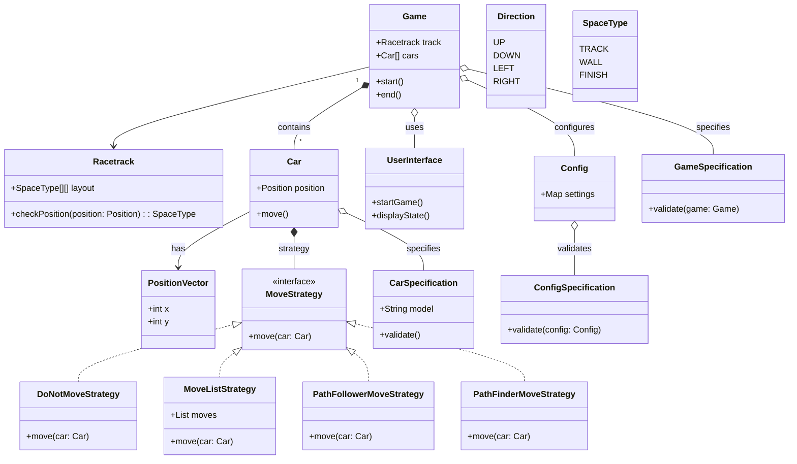

# Team3-DownForAnything-projekt1-racetrack

## About
Racetrack is a digital adaptation of the classic strategic racing game, tailored for a text-based interface in Java. Players navigate their cars on a grid-like racetrack, managing speed and direction to avoid obstacles and outmaneuver opponents to cross the finish line first. This project showcases a careful blend of strategy and planning, requiring players to think ahead with every move.

Developed with a focus on software engineering principles, Racetrack features a structured codebase that upholds standards of readability, maintainability, and performance. Employing feature branches and peer code reviews, our collaborative development process ensures a refined gaming experience. Dive into Racetrack for a strategic race that combines the simplicity of text with the complexity of racing dynamics.

## How to play
To play the Racetrack game, follow these instructions:

1. **Starting the Game**: Launch the game application. Upon starting, you will be greeted with a welcome message: "Welcome to Racetrack!".

2. **Selecting a Track**: The game will prompt you to choose a track from a list of available tracks. Each track is listed with a number. Enter the number of the track you wish to race on.

3. **Choosing Move Strategies for Cars**: For each car on the track, you will need to select a move strategy. The game will present you with options such as not moving, user control, following a predetermined path, or using an AI to find the path. Select the desired strategy by entering the number corresponding to it.

4. **Playing the Game**:
   - If you chose a user-controlled strategy, you will be asked to input directions to move your car. Valid directions are `UP`, `DOWN`, `LEFT`, `RIGHT`, `NONE` (to maintain current direction), `QUIT` (to exit the game), and diagonal movements like `DOWN_RIGHT`, `UP_RIGHT`, `UP_LEFT`, `DOWN_LEFT`.
   - Enter your move choice based on the current game situation. Your goal is to navigate the car through the track, avoid crashing into walls or other cars, and cross the finish line.
   - The game progresses by turns. After each move, the game updates the track's state, showing the positions of all cars.

5. **Crashes**: If your car crashes (into a wall or another car), it will be marked as crashed, and you will no longer be able to move it for the remainder of the game.

6. **Winning the Game**: The game continues until a car crosses the finish line following the correct direction indicated by the finish line markers (`<`, `>`, `^`, `v`). The game announces the winning car and prompts you to quit.

7. **Exiting the Game**: You can exit the game at any time by typing `QUIT` when prompted for a direction or after the game concludes, follow the prompt to quit the game.

Enjoy racing and strategizing your path to victory!

## Branch modelling
To further enhance the quality and integrity of our project, we implemented a rigorous code review process that came into play at significant milestones. After completing major sections of work or achieving substantial progress on a feature branch, the responsible developer would initiate a pull request. This process was integral to our workflow, ensuring that every significant update underwent thorough scrutiny before integration into the main branch.

The pull request process was not just a formality but a critical review stage where another team member, different from the one who developed the feature, conducted an exhaustive evaluation. This peer review served multiple purposes: it ensured code quality, maintained consistency across the project, and facilitated knowledge transfer within the team. Reviewers were tasked with examining the code for functionality, adherence to project standards, potential bugs, and overall performance. They also provided constructive feedback, suggesting improvements or optimizations where necessary.

This collaborative review process not only safeguarded our project from errors and inconsistencies but also fostered a culture of learning and mutual assistance. By having different team members review each other's work, we ensured a fresh perspective on every feature, which often led to valuable insights and enhancements. Moreover, this approach minimized the risk of introducing bugs into the main branch, thereby maintaining the project's stability and integrity.

Once a pull request was thoroughly reviewed and deemed satisfactory, it was then merged into the main branch. This methodical approach to integration helped us maintain a clean, stable, and well-documented codebase, which was crucial for the successful completion of our game project.

## Test concept
In our JUnit testing framework, we systematically employ equivalence class partitioning to validate the functionality of the Car and Game classes, focusing specifically on the accelerate, move, and doCarTurn methods, as well as the PATH_FOLLOWER and PATH_FINDER strategies. This approach groups input conditions into sets that the program treats equivalently, ensuring comprehensive test coverage with a streamlined set of test cases. Each test case is meticulously documented to indicate the equivalence class it represents. Detailed information about these classes and their corresponding tests can be found in the accompanying table.

### Class Car
Equivalence tests for method move() and accelerate():

| Equivalence Class | Test Case | Description |
| ----------------- | --------- | ----------- |
| accelerate | `testAccelerateValidDirection` | Tests accelerating the car to the right, ensuring velocity is updated correctly. |
| accelerate | `testAccelerateWithNull` | Tests the response of accelerating the car with a null direction, expecting an IllegalArgumentException. |
| accelerate | `testAccelerateMaximumOneDirection` | Tests the effect of accelerating the car twice upwards, checking for correct velocity update. |
| accelerate | `testAccelerateInOppositeDirections` | Tests accelerating the car in opposite directions to check if they cancel each other out. |
| accelerate | `testAccelerateMultipleDirections` | Tests the cumulative effect of accelerating the car in multiple directions. |
| move | `testMoveWithNoVelocity` | Verifies that the car's position remains unchanged when moved with zero velocity. |
| move | `testMoveWithMaxPositiveVelocity` | Checks that the car moves correctly when set to maximum positive velocity. |
| move | `testMoveWithMaxNegativeVelocity` | Ensures the car's position updates correctly when moved with maximum negative velocity. |
| move | `testMoveAfterResettingVelocity` | Tests car movement after velocity has been reset to zero, expecting no position change. |

### Class Game
Equivalence tests for method doCarTurn():

| equivalence class      | Test case | description |
| ----------- | ----------- |-----------|
| testDoCarTurn |	`game.doCarTurn(LEFT)` |	Car A should move to the left, updating position and velocity accordingly.|
| testDoCarTurn |	`game.doCarTurn(RIGHT)` |	Car B should move to the right, updating position and velocity accordingly.|
| testDoCarTurn |	`game.doCarTurn(DOWN_LEFT)` |	Car A should move down left, updating position and velocity accordingly.|
| testDoCarTurn |	`game.doCarTurn(UP_RIGHT)` |	Car B should move up right, updating position and velocity accordingly.|
| testDoCarTurn |	`game.doCarTurn(RIGHT)` |	Car A should move right, updating position and velocity accordingly.|
| testDoCarTurn |	`game.doCarTurn(LEFT)` |	Car B should move left, updating position and velocity accordingly.|
| testDoCarTurn |	`game.doCarTurn(UP_LEFT)` |	Car A should move up left, updating position and velocity accordingly.|
| testDoCarTurn |	`game.doCarTurn(DOWN_RIGHT)` |	Car B should move down right, updating position and velocity accordingly.|
| testDoCarTurn |	`game.doCarTurn(NONE)` |	Both cars move with their current velocity, updating position accordingly.|

## Class diagram
This abstracted UML diagram provides a clear, high-level overview of the game's architecture, highlighting key classes and their interactions. It effectively illustrates the system's modularity and the relationships between components, essential for quick comprehension and efficient navigation of the codebase.

The thorough class diagram can be found in the root directory of this repository under the name "class_diagram.png".

This class diagram describes the architecture of a racing game project where various cars compete against each other on a racetrack. The aim is to highlight the project's modular structure, flexibility, and extensibility. The organization into packages, classes, methods, and their dependencies enables a new programmer to quickly understand the project and contribute.

*Packages and Their Justification:*

**Given Package:** Contains specifications for the Car, Config, Game and Track classes, which are essential for the game's core functionality.

**Strategy Package:** Houses the MoveStrategy interface and its implementations, allowing for different movement strategies to be easily integrated into the game.

*Classes and Their Justification:*

**Car:** Represents a vehicle with properties such as position, velocity, and state (e.g., crashed). Methods for movement and state changes reflect the car's interactions within the game.

**MoveStrategy and Implementations:** Define various movement strategies for the cars, increasing the game's flexibility by adapting to different scenarios.

**Track and Game:** Core classes managing the racetrack and game logic, including car management and conducting the race.

The structure is designed to make the system as intuitive and extensible as possible, allowing for easy integration of new features, such as different types of cars, tracks, or game modes, without significant alterations to the existing codebase. This modularity and clear separation of concerns facilitate a new programmer's quick acclimation to the project.
